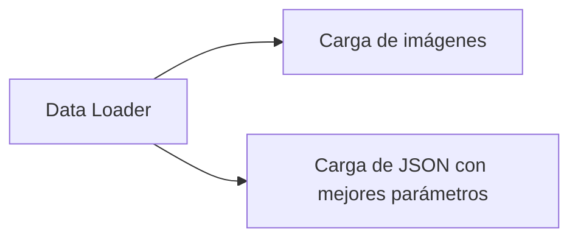
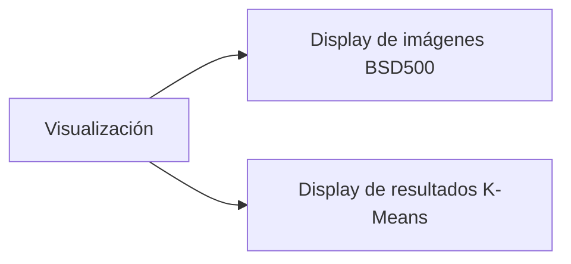

# Custom K-Means

## Instalación

Este proyecto utiliza [uv](https://docs.astral.sh/uv/) como gestor de paquetes y entornos virtuales de Python.

### Instalar uv

```bash
# macOS y Linux
curl -LsSf https://astral.sh/uv/install.sh | sh

# Windows
powershell -c "irm https://astral.sh/uv/install.ps1 | iex"
```

Para más opciones de instalación, consulta la [documentación oficial de uv](https://docs.astral.sh/uv/getting-started/installation/).

### Instalar dependencias del proyecto

```bash
# Instalar todas las dependencias definidas en pyproject.toml
uv sync

# Activar el entorno virtual creado por uv
source .venv/bin/activate  # macOS/Linux
# o
.venv\Scripts\activate  # Windows
```

## Funciones Utilitarias

### Módulo Data Loader

El módulo `src/data_loader` proporciona una interfaz unificada para acceder a los datos del proyecto. Permite cargar imágenes del dataset BSD500 como numpy arrays, así como archivos JSON con snapshots de parámetros y resultados de experimentos previos. Los JSON snapshots son esenciales porque contienen los mejores valores encontrados para los parámetros (como k_clusters, velocity_method, alpha, etc.) en experimentos anteriores, junto con las métricas de calidad obtenidas (PRI scores, mejoras, conteos de contornos). El DataLoader carga automáticamente la versión más reciente cuando existen múltiples archivos para la misma imagen, y localiza el directorio de datos sin importar desde dónde se ejecute el código.



### Módulo de Visualización

El módulo `src/viz` concentra toda la lógica de visualización para evitar cargar el Marimo Notebook con métodos de creación de plots y gráficos. Proporciona funciones especializadas para mostrar imágenes del dataset BSD500 en grids horizontales, así como para visualizar resultados de K-Means clustering en layouts estructurados. Las funciones manejan automáticamente la configuración de subplots, títulos, ejes y formatos de imagen, permitiendo que el notebook se mantenga limpio con llamadas simples de una línea que retornan figuras listas para mostrar.


