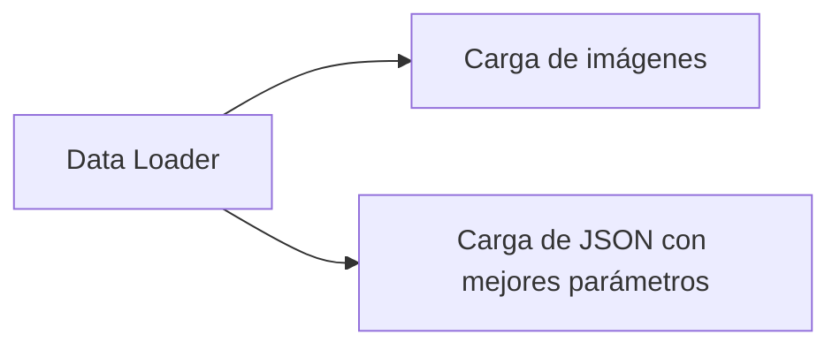
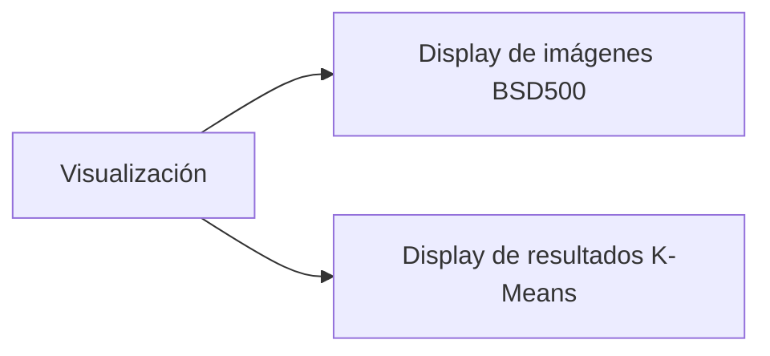
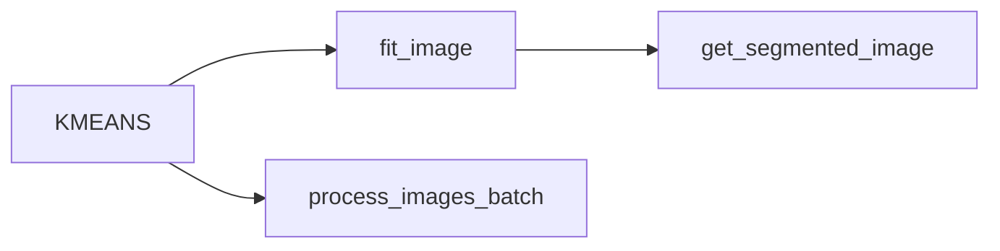
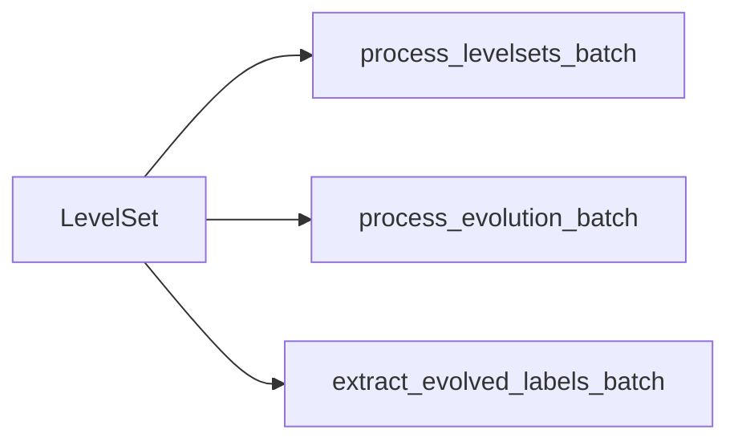
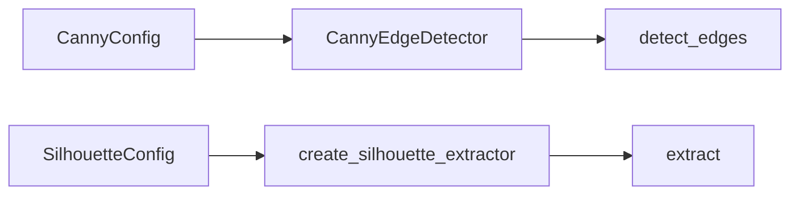

# Custom K-Means Clustering

## Instalación

Este proyecto utiliza [uv](https://docs.astral.sh/uv/) como gestor de paquetes y entornos virtuales de Python.

### Instalar uv

```bash
# macOS y Linux
curl -LsSf https://astral.sh/uv/install.sh | sh

# Windows
powershell -c "irm https://astral.sh/uv/install.ps1 | iex"
```

Para más opciones de instalación, consulta la [documentación oficial de uv](https://docs.astral.sh/uv/getting-started/installation/).

### Instalar dependencias del proyecto

```bash
# Instalar todas las dependencias definidas en pyproject.toml
uv sync

# Activar el entorno virtual creado por uv
source .venv/bin/activate  # macOS/Linux
# o
.venv\Scripts\activate  # Windows
```

# Modulos

## Funciones Utilitarias

### Módulo Data Loader

El módulo `src/data_loader` proporciona una interfaz unificada para acceder a los datos del proyecto. Permite cargar imágenes del dataset BSD500 como numpy arrays, así como archivos JSON con snapshots de parámetros y resultados de experimentos previos. Los JSON snapshots son esenciales porque contienen los mejores valores encontrados para los parámetros (como k_clusters, velocity_method, alpha, etc.) en experimentos anteriores, junto con las métricas de calidad obtenidas (PRI scores, mejoras, conteos de contornos). El DataLoader carga automáticamente la versión más reciente cuando existen múltiples archivos para la misma imagen, y localiza el directorio de datos sin importar desde dónde se ejecute el código.



### Módulo de Visualización

El módulo `src/viz` concentra toda la lógica de visualización para evitar cargar el Marimo Notebook con métodos de creación de plots y gráficos. Proporciona funciones especializadas para mostrar imágenes del dataset BSD500 en grids horizontales, así como para visualizar resultados de K-Means clustering en layouts estructurados. Las funciones manejan automáticamente la configuración de subplots, títulos, ejes y formatos de imagen, permitiendo que el notebook se mantenga limpio con llamadas simples de una línea que retornan figuras listas para mostrar.



### Módulo K-Means Clustering

El módulo `src/kmeans` proporciona un wrapper limpio sobre [sklearn.cluster.KMeans](https://scikit-learn.org/0.19/modules/generated/sklearn.cluster.KMeans.html) específicamente diseñado para segmentación de imágenes. Simplifica el flujo de trabajo al manejar automáticamente el reshaping de imágenes RGB, normalización de datos, y generación de imágenes segmentadas con colores cuantizados. El módulo expone tres componentes principales: `KMeansConfig` para configuración de parámetros (número de clusters, iteraciones, método de inicialización), la clase `KMeans` que encapsula el algoritmo de sklearn, y `process_images_batch()` para procesamiento eficiente de múltiples imágenes usando parámetros guardados en snapshots.



### Módulo Level Set

El módulo `src/level_set` refina las segmentaciones de K-Means mediante level set evolution, suavizando fronteras mientras las detiene en bordes fuertes de la imagen. Utiliza [scikit-fmm](https://github.com/scikit-fmm/scikit-fmm) para calcular signed distance functions mediante Fast Marching Method, transformando las etiquetas discretas de K-Means en representaciones continuas donde cada píxel almacena su distancia al borde del cluster más cercano. Para el cálculo de velocidad, emplea [scipy.ndimage](https://docs.scipy.org/doc/scipy/reference/ndimage.html) que proporciona herramientas fundamentales para implementar velocidades personalizadas de level set: cálculo de gradientes mediante filtros Sobel, estimación de curvatura por diferencias finitas, y funciones edge-stopping basadas en gradiente inverso gaussiano. El módulo ejecuta evolución iterativa con reinicialización periódica para mantener estabilidad numérica.



### Módulo PRI (Probabilistic Rand Index)

El módulo `src/pri` implementa el cálculo del **Probabilistic Rand Index (PRI)**, una métrica de evaluación de segmentación que no depende de bibliotecas externas. Esta es una implementación propia que compara la segmentación automática generada por el algoritmo con múltiples anotaciones humanas (ground truths) del dataset BSD500. El PRI cuantifica qué tan bien la segmentación automática coincide con el consenso humano mediante la fórmula: **PRI = (1/T) Σ [c_im × p_im + (1 - c_im) × (1 - p_im)]**, donde c_im indica si dos píxeles tienen la misma etiqueta en la segmentación automática, y p_im representa la probabilidad de que esos píxeles tengan la misma etiqueta según los ground truths. La implementación utiliza muestreo aleatorio de 10,000 pares de píxeles para eficiencia computacional y emplea un sistema de caché (PRICacheManager) para almacenar los valores de p_im y evitar recalcularlos en evaluaciones posteriores.

#### Ejemplos de la Ecuación PRI

La siguiente tabla muestra cómo diferentes casos contribuyen al score PRI final:

| c_im | p_im | c_im × p_im | (1-c_im) × (1-p_im) | Contribución Total | Interpretación |
|------|------|-------------|---------------------|--------------------|----------------|
| 1 | 1.0 | 1.0 | 0.0 | **1.0** | Perfecto: segmentación coincide, GTs están de acuerdo |
| 1 | 0.8 | 0.8 | 0.0 | **0.8** | Bueno: segmentación coincide, GTs mayormente de acuerdo |
| 1 | 0.5 | 0.5 | 0.0 | **0.5** | Ambiguo: segmentación coincide, GTs divididos |
| 0 | 0.5 | 0.0 | 0.5 | **0.5** | Ambiguo: segmentación difiere, GTs divididos |
| 0 | 0.2 | 0.0 | 0.8 | **0.8** | Bueno: segmentación difiere, GTs mayormente difieren |
| 0 | 0.0 | 0.0 | 1.0 | **1.0** | Perfecto: segmentación difiere, GTs están de acuerdo |

**Notas:**
- **c_im = 1**: Los píxeles i y m tienen la misma etiqueta en la segmentación (mismo cluster)
- **c_im = 0**: Los píxeles i y m tienen diferentes etiquetas en la segmentación (clusters distintos)
- **p_im**: Fracción de ground truths donde los píxeles tienen la misma etiqueta (e.g., 0.8 = 4 de 5 GTs)
- **PRI final**: Promedio de las contribuciones de los 10,000 pares muestreados


### Módulo Canny Edge Detection

El módulo `src/canny` implementa detección de bordes y extracción de siluetas para visualizar los límites de los clusters obtenidos. Utiliza el detector de bordes Canny de [OpenCV](https://docs.opencv.org/4.x/da/d22/tutorial_py_canny.html) (cv2.Canny) para identificar transiciones entre diferentes regiones de segmentación, implementando lo mencionado en el paper: *"we utilize the Canny edge detector to detect the edge information of the boundary of each cluster"*. El módulo proporciona dos componentes principales: **CannyEdgeDetector** que aplica el algoritmo Canny a las etiquetas de segmentación evolucionadas para detectar bordes precisos entre clusters, y **SilhouetteExtractor** que convierte los mapas de bordes en siluetas limpias mediante operaciones morfológicas (closing) y flood fill para cerrar gaps, seguido de [cv2.findContours](https://learnopencv.com/contour-detection-using-opencv-python-c/) para extraer contornos externos que se rellenan completamente para crear máscaras binarias. El proceso completo incluye normalización de etiquetas, detección de bordes con umbrales configurables, cierre morfológico de gaps, extracción de contornos externos con cv2.findContours, relleno de contornos, y generación de máscaras binarias listas para visualización o comparación con ground truth.

